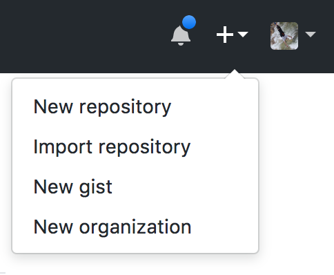
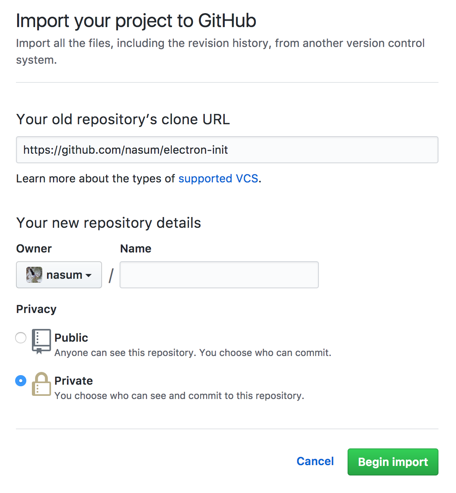
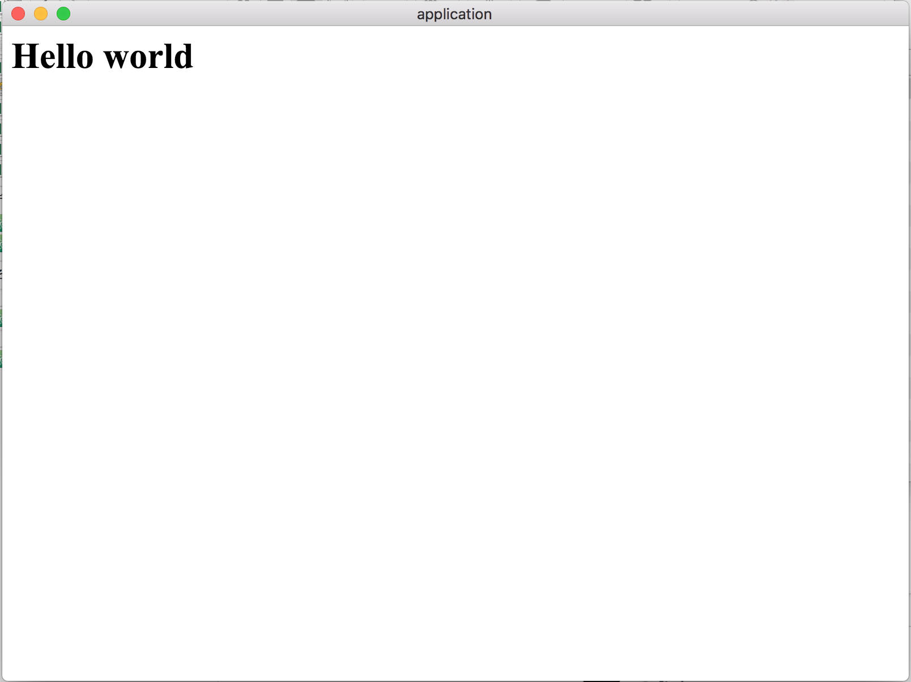

# electron-init

This is a template for making development with electron fast.

Babel and eslint are already set up.

## how to use

1. fork or import this repository.





2. build this project.

```bash
$ yarn run dev
```

3. run electron application.

```bash
$ yarn run start
```


## Packaging application

To package an application, enter the following command.

```bash
$ yarn run pack_mac # for mac user
```

It is output to the pack directory.
